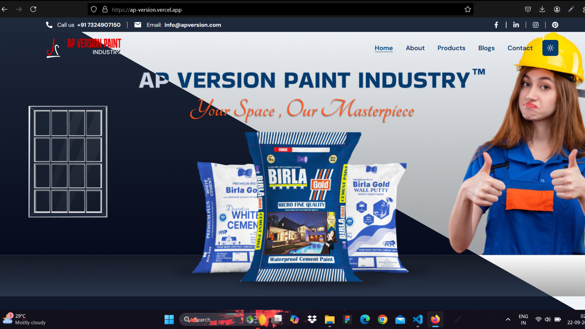
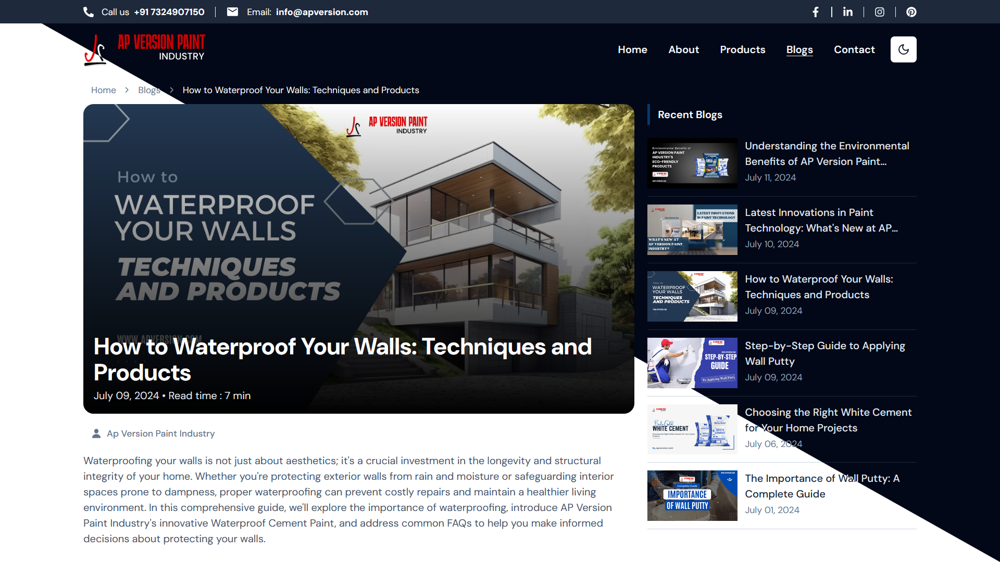

# AP Version - Paint Industry Website

  
  
  
  
  
  
  

## About The Project

AP Version is a modern and dynamic website developed for the paint industry. This freelance project showcases a landing page, blogs section, product catalog, and much more. The entire UI, including both light and dark modes, was designed and developed by me.

Check out the live website [here](https://ap-version.vercel.app/).

 
 
 

### Key Features:

- **Landing Page**: Custom-designed responsive landing page with interactive animations and light/dark mode support.
- **Product Section**: Detailed product catalog showcasing various paint products.
- **Blogs Section**: Dynamic blogs with rich content, covering the latest industry trends.
- **Dark Mode/Light Mode**: Smooth and intuitive theme switching.
- **Animations**: Integrated AOS (Animate On Scroll) for scroll animations.
  
### Built With

This project was developed using the following technologies:

- ![Vite][Vite-icon]
- ![React][React-icon]
- ![TypeScript][TypeScript-icon]
- ![TailwindCSS][TailwindCSS-icon]
- ![Radix UI][RadixUI-icon]
- ![Axios][Axios-icon]
- ![Embla Carousel][Embla-icon]

## Contributing

Contributions are welcome! Here's how you can help:

1. Fork the repository.
2. Create a feature branch (`git checkout -b feature/AmazingFeature`).
3. Commit your changes (`git commit -m 'Add some AmazingFeature'`).
4. Push to the branch (`git push origin feature/AmazingFeature`).
5. Open a pull request.

## License

Distributed under the ISC License. See `LICENSE` for more information.

## Contact

Deepak Kumar - [deepakjamui26@gmail.com](mailto:deepakjamui26@gmail.com)

GitHub: [https://github.com/deepak-raaaz](https://github.com/deepak-raaaz)

(<a href="#readme-top">back to top</a>)

<!-- MARKDOWN LINKS & IMAGES -->

[Vite-icon]: https://img.shields.io/badge/Vite-646CFF?style=for-the-badge&logo=vite&logoColor=white
[React-icon]: https://img.shields.io/badge/React-61DAFB?style=for-the-badge&logo=react&logoColor=black
[TypeScript-icon]: https://img.shields.io/badge/Typescript-%23007ACC.svg?style=for-the-badge&logo=typescript&logoColor=white
[TailwindCSS-icon]: https://img.shields.io/badge/TailwindCSS-38B2AC?style=for-the-badge&logo=tailwind-css&logoColor=white
[RadixUI-icon]: https://img.shields.io/badge/Radix%20UI-111?style=for-the-badge&logo=radix-ui&logoColor=white
[Axios-icon]: https://img.shields.io/badge/Axios-5A29E4?style=for-the-badge&logo=axios&logoColor=white
[Embla-icon]: https://img.shields.io/badge/Embla%20Carousel-FF6A00?style=for-the-badge
